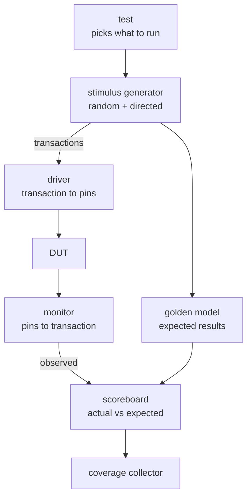

# hdl-verify

A reusable hardware verification framework built on [cocotb](https://www.cocotb.org/) using constrained-random stimulus, transaction-level drivers and monitors, scoreboarding against golden models, and functional coverage. Designed to be shared across multiple RTL projects rather than rewritten per design.

## Status

**In active development.** Toolchain, packaging, and the clock/reset harness are working; the transaction, driver, monitor, and scoreboard layers are next. The core is being validated against a set of existing protocol controllers (UART, SPI, I2C). No tagged release yet — interfaces are expected to change until the core has been exercised by at least three distinct designs.

See the [roadmap](#roadmap) for what is planned and what is complete.

## Architecture

The environment separates *what to test* from *how to drive it*, with the driver and monitor forming the only boundary that understands pin-level timing.

| Component | Responsibility |
|---|---|
| **Test** | Selects which scenario runs and when it is complete. |
| **Stimulus generator** | Produces transactions: constrained-random, directed, or both. Seeded for reproducibility. |
| **Driver** | Converts a transaction into pin-level activity. The only component that knows the DUT's timing. |
| **Monitor** | Passively observes DUT pins and reconstructs transactions. Never drives. |
| **Golden model** | An independent implementation of correct behavior, written separately from the RTL. |
| **Scoreboard** | Compares observed transactions against expected results and tallies pass/fail. |
| **Coverage collector** | Records which behaviors and corner cases have been exercised. |

The framework core provides the test runner, stimulus utilities, scoreboard base, coverage collection, and reporting. Each design under test supplies a thin adapter: its own driver, monitor, golden model, and coverage model.

## Design decisions

Recorded so the reasoning survives:

1. **Transactions are objects, not bare values.** SPI transfers carry two payloads (full duplex) and I2C carries an address, data, and an acknowledgment. A plain integer cannot represent those, so the base class provides behavior rather than assuming a payload shape.
2. **A shared harness owns clock and reset.** Individual tests do not repeat setup boilerplate, so clock periods and reset sequences cannot drift between tests.
3. **Expected results are derived from observed inputs, not from test intent.** An input monitor reports what the DUT actually received, and the golden model computes the expectation from that. If the driver has a bug, this catches it; declaring expectations in the test would hide it.
4. **The core owns the loops; each DUT fills in one step.** Adding a new design must not require changes inside `src/hdl_verify/`. That constraint is the test of whether the abstraction is real.
5. **Tests ask a predicate whether to continue.** Fixed transaction counts today, coverage-driven closure later, without restructuring the test loop.
6. **Every random run reports its seed and accepts one.** A randomized failure that cannot be reproduced cannot be debugged.

## Usage

To verify a design with this framework, a project implements three things specific to its DUT: a driver that turns transactions into pin activity, a monitor that recovers transactions from pin activity, and a golden model that computes expected results. Everything else (randomization, scoreboarding, coverage collection, regression running, and reporting) comes from the framework core.

Designs consume the framework as a dependency rather than vendoring a copy, so improvements propagate to every project that uses it.

*Concrete usage examples will be added here as the API stabilizes.*

## Examples

The `examples/` directory contains complete verification environments for real designs, serving as both validation of the framework and reference implementations:

| Example | Design under test | Status |
|---|---|---|
| `examples/uart/` | 8N1 UART transmitter and receiver | In progress |
| `examples/spi/` | SPI Mode-0 master | Planned |
| `examples/i2c/` | I2C master (single-byte write) | Planned |

## Roadmap

### Phase 0 — Foundation

- [x] cocotb + Icarus Verilog toolchain running against a real DUT
- [x] Installable package (`src/` layout, editable install)
- [x] Clock and optional-reset harness, DUT-agnostic by signal handle

### Phase A — Core framework, validated on the UART

- [x] Transaction base class (comparison, formatting) + UART subclass
- [x] Driver base class (owns the loop) + UART driver (fills the step)
- [x] Monitor base class + UART output monitor
- [x] UART input monitor, so expectations derive from observed stimulus
- [ ] UART golden model
- [ ] Scoreboard with error counting and reporting
- [ ] First self-checking UART test — the first test capable of failing
- [ ] Constrained-random stimulus generator with seed reporting and override
- [ ] Functional coverage collection and end-of-run report
- [ ] Coverage-aware done predicate

### Phase B — Proving reusability

- [ ] SPI adapter (transaction, driver, monitor, golden model) with **no changes to the core**
- [ ] I2C adapter — bidirectional line, addressing, acknowledgment
- [ ] Core API frozen once three distinct designs have exercised it

### Phase C — Release quality

- [ ] Unit tests for the framework itself
- [ ] CI running the full regression on every push
- [ ] Results section populated with coverage figures and bugs found
- [ ] Tagged `v0.1.0` release

## Results

Coverage figures and bugs found will be reported here as examples are completed.

## Requirements

- Python 3.10+
- [cocotb](https://www.cocotb.org/)
- A supported simulator — developed against [Icarus Verilog](https://steveicarus.github.io/iverilog/)
- pytest, for running regressions

## License

MIT — see [LICENSE](LICENSE).
