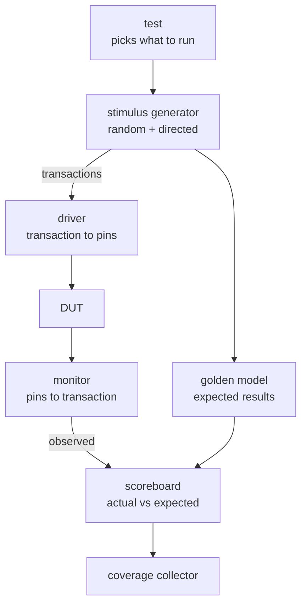

# hdl-verify

A reusable hardware verification framework built on [cocotb](https://www.cocotb.org/) using constrained-random stimulus, transaction-level drivers and monitors, scoreboarding against golden models, and functional coverage. Designed to be shared across multiple RTL projects rather than rewritten per design.

## Status

**In active development.** The framework core is being built and validated against a set of existing protocol controllers (UART, SPI, I2C). No tagged release yet. Interfaces are expected to change until the core has been exercised by at least three distinct designs.

See the [roadmap](#roadmap) for what is planned and what is complete.

## Architecture

The environment separates *what to test* from *how to drive it*, with the driver and monitor forming the only boundary that understands pin-level timing.

| Component | Responsibility |
|---|---|
| **Test** | Selects which scenario runs and when it is complete. |
| **Stimulus generator** | Produces transactions: constrained-random, directed, or both. Seeded for reproducibility. |
| **Driver** | Converts a transaction into pin-level activity. The only component that knows the DUT's timing. |
| **Monitor** | Passively observes DUT pins and reconstructs transactions. Never drives. |
| **Golden model** | An independent implementation of correct behavior, written separately from the RTL. |
| **Scoreboard** | Compares observed transactions against expected results and tallies pass/fail. |
| **Coverage collector** | Records which behaviors and corner cases have been exercised. |

The framework core provides the test runner, stimulus utilities, scoreboard base, coverage collection, and reporting. Each design under test supplies a thin adapter: its own driver, monitor, golden model, and coverage model.

## Usage

To verify a design with this framework, a project implements three things specific to its DUT: a driver that turns transactions into pin activity, a monitor that recovers transactions from pin activity, and a golden model that computes expected results. Everything else (randomization, scoreboarding, coverage collection, regression running, and reporting) comes from the framework core.

Designs consume the framework as a dependency rather than vendoring a copy, so improvements propagate to every project that uses it.

*Concrete usage examples will be added here as the API stabilizes.*

## Examples

The `examples/` directory contains complete verification environments for real designs, serving as both validation of the framework and reference implementations:

| Example | Design under test | Status |
|---|---|---|
| `examples/uart/` | 8N1 UART transmitter and receiver | Planned |
| `examples/spi/` | SPI Mode-0 master | Planned |
| `examples/i2c/` | I2C master (single-byte write) | Planned |

## Roadmap

- [ ] Core: clock/reset fixtures and test runner
- [ ] Core: transaction base class and constrained-random stimulus utilities
- [ ] Core: driver and monitor base classes
- [ ] Core: scoreboard with configurable comparison
- [ ] Core: functional coverage collection and reporting
- [ ] Example: UART verification environment
- [ ] Example: SPI verification environment
- [ ] Example: I2C verification environment
- [ ] CI: regression suite on every push
- [ ] Packaging: installable release

## Results

Coverage figures and bugs found will be reported here as examples are completed.

## Requirements

- Python 3.10+
- [cocotb](https://www.cocotb.org/)
- A supported simulator — developed against [Icarus Verilog](https://steveicarus.github.io/iverilog/)
- pytest, for running regressions

## License

MIT — see [LICENSE](LICENSE).
